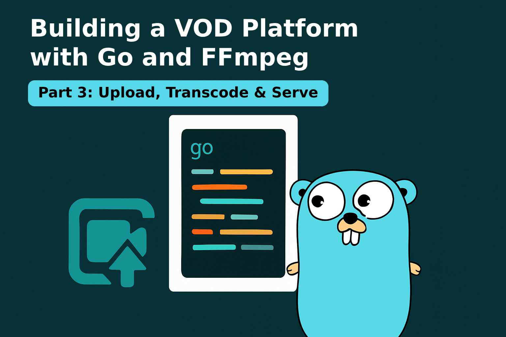
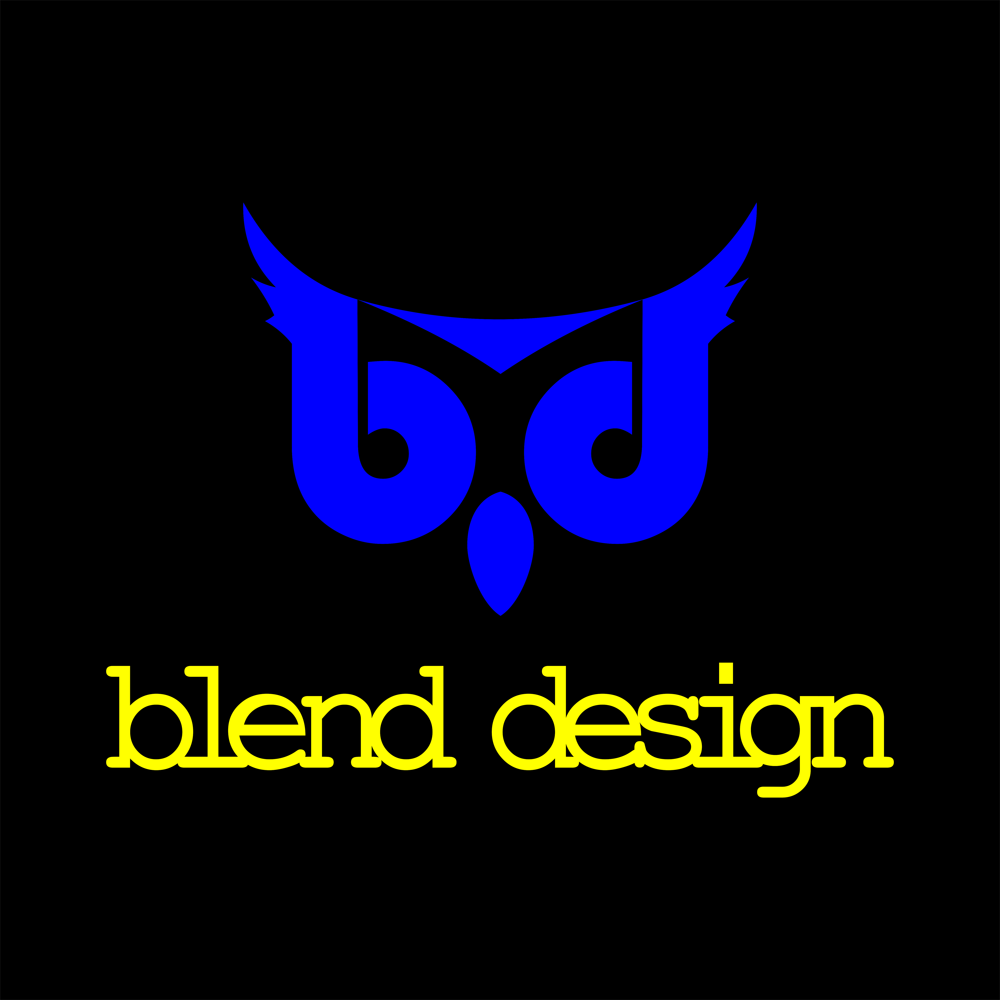

# Building a VOD Platform with Go and FFmpeg (Tutorial Series, Article 3)

<p align="center">
  
</p>

<p align="center">
  
</p>

<p align="center">
  <a href="https://medium.com/@o.rasouli92"></a>
  
  
  
  
  
</p>

# Vuilding a VOD Platform with Go and FFmpeg (Tutorial Series, Article 3)

Welcome to **VOD Streamer EDU**, an educational project demonstrating how to build a Video On Demand (VOD) streaming backend in Go using Clean Architecture and FFmpeg.

This repository accompanies the **third article** in my Medium tutorial series:  
👉 [Read more on Medium – @o.rasouli92](https://medium.com/@o.rasouli92)

---

## Table of Contents
- [Building a VOD Platform with Go and FFmpeg (Tutorial Series, Article 3)](#building-a-vod-platform-with-go-and-ffmpeg-tutorial-series-article-3)
- [Vuilding a VOD Platform with Go and FFmpeg (Tutorial Series, Article 3)](#vuilding-a-vod-platform-with-go-and-ffmpeg-tutorial-series-article-3)
  - [Table of Contents](#table-of-contents)
  - [✨ Features](#-features)
  - [🚀 Quick Start](#-quick-start)
  - [📤 Upload a Video](#-upload-a-video)
  - [📺 Test HLS Streaming](#-test-hls-streaming)
  - [🗂️ Project Structure](#️-project-structure)
  - [📖 About the Series](#-about-the-series)
  - [📝 License](#-license)

---

## ✨ Features

- Clean Architecture project structure in Go
- Video upload via REST API
- Automatic transcoding to HLS using FFmpeg
- HLS streaming endpoints for playback
- Ready for extension and learning

---

## 🚀 Quick Start

1. **Clone the repository:**
   ```bash
   git clone https://github.com/OmidRasouli/vod-streamer-edu.git
   cd vod-streamer-edu
   ```

2. **Add a test video:**  
   Place a sample video (e.g., `.mp4`, `.mkv`) in `public/test/`.  
   Example provided:  
   `public/test/Pixar.Popcorn.S01E04.1080p.WEB-DL.mkv`

3. **Run the server:**
   ```bash
   go run cmd/server/main.go
   ```

---

## 📤 Upload a Video

Upload a video for processing and HLS conversion:

```bash
curl -X POST http://localhost:8080/upload \
  -F "video=@/vod-streamer-edu/public/test/Pixar.Popcorn.S01E04.1080p.WEB-DL.mkv"
```

> **Tip:** Use the provided curl command to quickly test video uploads!

---

## 📺 Test HLS Streaming

1. After upload, note the returned video UUID.
2. Construct your HLS master playlist URL:
   ```
   http://localhost:8080/stream/{id}/master.m3u8
   ```
   Replace `{id}` with your video UUID.
3. Open [hls.js demo player](https://hlsjs.video-dev.org/demo/?src=) and paste your playlist URL after `src=`, e.g.:
   ```
   https://hlsjs.video-dev.org/demo/?src=http://localhost:8080/stream/your-uuid/master.m3u8
   ```

---

## 🗂️ Project Structure

```
cmd/server/                 # Application entrypoint
configs/                    # Configuration files
internal/
  controller/http/          # HTTP handlers
  domain/                   # Domain models and ports
  entity/                   # Core entities
  infrastructure/           # FFmpeg and storage
  usecase/                  # Application use cases
public/                     # Static files and test videos
```

---

## 📖 About the Series

This is the third article in a hands-on series:

- **Article 1:** [Building a VOD Platform with Go and FFmpeg — Part 1: Foundations](https://medium.com/@o.rasouli92/building-a-vod-platform-with-go-and-ffmpeg-part-1-foundations-771e1e14f79b)
- **Article 2:** [Building a VOD Platform with Go and FFmpeg — Part 2: Deep Dive into HLS and M3U8 Playlists](https://medium.com/@o.rasouli92/building-a-vod-platform-with-go-and-ffmpeg-part-2-deep-dive-into-hls-and-m3u8-playlists-29ffbad7a20a)
- **Article 3 (this branch):** [Building a VOD Platform with Go and FFmpeg - Part 3: Upload, Transcode & Serve](https://medium.com/@o.rasouli92)

Read the full series: [@o.rasouli92 on Medium](https://medium.com/@o.rasouli92)

---

## 📝 License

MIT License © 2025 Omid Rasouli
